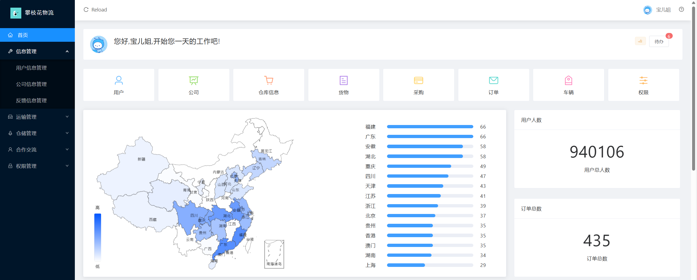
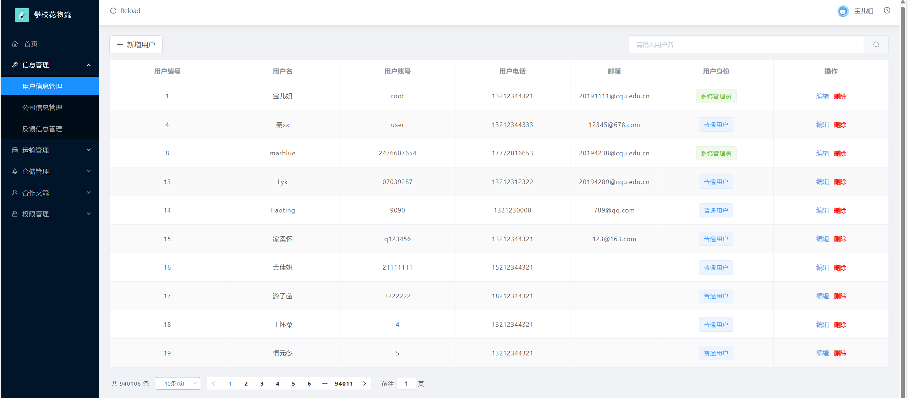
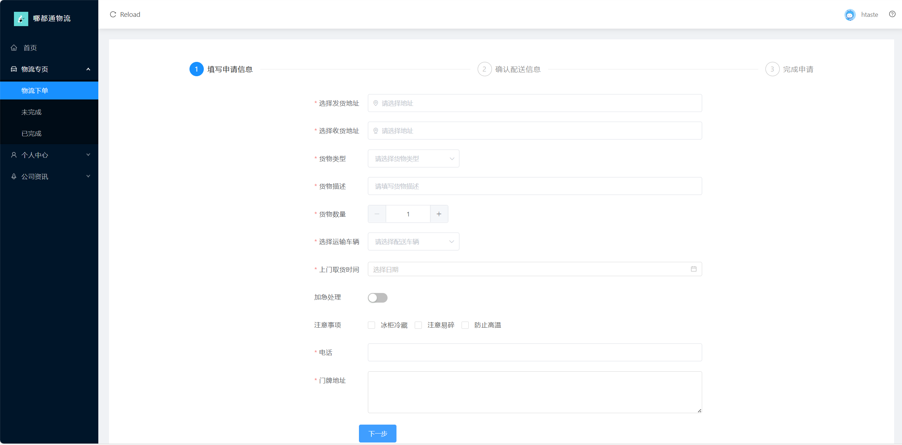

# 哪都通物流管理系统

## 项目介绍
基于Springboot+Mybatis Plus+Redis+Vue的物流管理系统，实现“用户下单→货物入库→车辆调度→送货上门”的业务流程。总体向外提供物流运输服务，对内实现物流信息管理数字化。

本项目为**后端项目**

前端项目移步至[前端地址](https://gitee.com/liyke/web-app)

整体效果

<figure style="text-align: center">
  
  <figcaption><strong>门户页</strong></figcaption>
</figure>
<figure style="text-align: center">
  
  <figcaption><strong>管理员主页</strong></figcaption>
</figure>
<figure style="text-align: center">
  
  <figcaption><strong>用户管理页</strong></figcaption>
</figure>
<figure style="text-align: center">
  
  <figcaption><strong>用户主页</strong></figcaption>
</figure>

项目预览：[点我点我](https://www.pzh-code.cn)，~~轻点服务器承受不住（狗头~~

管理员：`root`, `123456`

普通用户：`user`, `123456`

------
## 框架

后端：`Springboot + MyBatis Plus + Redis + Nginx`

前端：`Vue2.x`

## 版本

    
    
    
     
    

## 开发工具

### 后端

- IDEA Professional `2021.3.1`

#### 数据库管理工具

- Navicat Premium `15.0.x`

#### API工具

- Postman `9.19.0`
- Apifox `2.1.25`

### 前端

- HBuilder X `3.4.x`

#### node.js工具包

- npm `8.12.2`
- nvm `1.1.9`

## 项目运行
1. 加载依赖：加载`./pom.xml`，
2. 数据库准备：
   1. MySQL：创建一个名为`pzh_db`数据库，然后导入`.\src\main\resources\sql\pzh_db.sql`数据库脚本文件，**user表有180+w条数据，导入需要点耐心**
   2. Redis：使用`db0`，没有设置用户名和密码
4. 在`.\src\main\resources\application.yml`改数据库配置（MySQL、Redis），如用户名、密码
4. 运行：IDEA运行，或打包成jar包启动

## 项目部署
项目端口号为8080
