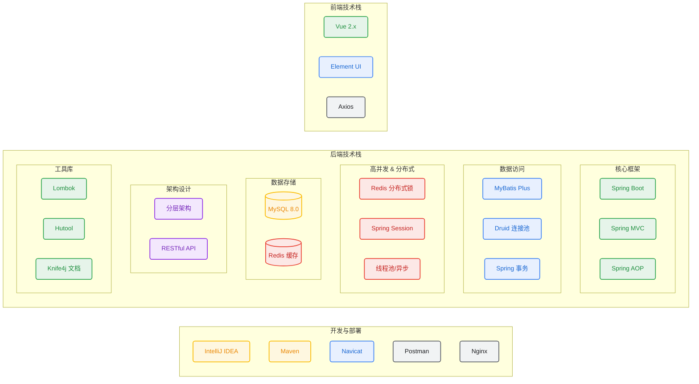

# 哪都通物流管理系统 (PZH Transportation System)

[](LICENSE)
[](https://spring.io/projects/spring-boot)
[](https://baomidou.com/)
[](https://redis.io/)

## 📖 项目介绍

**哪都通物流管理系统** 是一款基于 **Spring Boot + MyBatis Plus + Redis + Vue** 的现代化物流管理平台。系统实现了从“用户下单”到“货物送达”的全链路业务流程，旨在提供高效的物流运输服务与数字化的后台管理能力。

本项目为 **后端仓库**，前端项目请访问：[前端仓库地址](https://gitee.com/liyke/web-app)

### 核心功能
- **全流程管理**：涵盖订单管理、车辆调度、货物入库、人员管理等核心模块。
- **高性能架构**：引入 Redis 多级缓存与多线程批量处理，轻松应对高并发场景。
- **分布式支持**：集成分布式锁与分布式 Session，支持集群部署与水平扩展。
- **安全可靠**：基于 AOP 实现统一鉴权与日志记录，保障系统安全与可维护性。

---

## 🏗️ 系统架构



---

## ✨ 核心亮点

### 🚀 高并发与性能优化
- **多级缓存架构**: 引入 Redis 作为二级缓存，对高频访问的物流信息、用户信息进行缓存预热，显著降低 MySQL 数据库压力，提升系统 QPS。
- **海量数据导入**: 针对百万级用户/订单数据的初始化场景，采用 **多线程分片 + 批量插入** 策略。利用 `ThreadPoolExecutor` 自定义线程池对数据进行逻辑分片，配合 `CountDownLatch` 控制主线程等待，实现数据的高效并行写入。

### 🔒 分布式与可靠性
- **分布式锁实战**: 在集群部署环境下，使用 Redis (`setnx` / Redisson) 实现分布式锁，解决定时任务（如订单超时取消、库存盘点）在多节点重复执行的问题，确保任务的**幂等性**。
- **分布式 Session 登录**: 集成 **Spring Session Data Redis**，替代传统容器 Session。将用户登录状态持久化至 Redis 集群，解决多服务节点部署时的 Session 漂移问题，实现全链路的**分布式登录**与状态共享。
- **统一异常与事务**: 基于 `@Transactional` 保证核心业务（如下单扣减库存）的数据一致性，配合全局异常处理机制，确保系统在异常情况下的健壮性。

### 🛡️ 安全与规范
- **AOP 切面编程**: 通过 Spring AOP 实现统一的**登录校验**与**权限控制**，将非业务逻辑（如日志记录、鉴权）与核心业务解耦，提高代码的可维护性。
- **标准化接口文档**: 集成 **Knife4j (Swagger2)**，自动生成在线接口文档，支持离线导出与在线调试，降低前后端沟通成本。
- **统一响应体**: 封装统一的 `R` 结果对象，规范成功与失败的返回格式，便于前端统一解析。

---

## 🛠️ 技术栈

| 类别 | 技术 | 说明 |
| --- | --- | --- |
| **核心框架** | Spring Boot 2.7.1 | 容器与依赖注入 |
| **ORM 框架** | MyBatis Plus 3.4.3 | 数据持久层框架 |
| **数据库** | MySQL 8.0+ | 关系型数据库 |
| **连接池** | Druid 1.2.6 | 高性能数据库连接池 |
| **缓存/Session** | Redis / Spring Session | 缓存与分布式会话 |
| **API 文档** | Knife4j 3.0.3 | 增强版 Swagger 文档 |
| **工具库** | Lombok | 简化 Java 代码 |

---

## 📸 系统截图

<div align="center">
    
    
    <br>
    
    
</div>

---

## 🚀 快速开始

### 环境要求
- **JDK**: 1.8+
- **MySQL**: 8.0+
- **Redis**: 5.0+
- **Maven**: 3.8+

### 1. 克隆项目
```bash
git clone https://github.com/QinHaoting/pzh.git
```

### 2. 数据库准备
1. 创建数据库 `pzh_db`。
2. 导入脚本 `src/main/resources/sql/pzh_db.sql`。
   > **注意**: `user` 表包含大量测试数据 (约180w+条)，导入过程可能需要几分钟，请耐心等待。
3. 确保 Redis 服务已启动 (默认端口 6379，无密码)。

### 3. 修改配置
打开 `src/main/resources/application.yml`，根据本地环境修改数据库配置：
```yaml
spring:
  datasource:
    druid:
      username:  # 你的数据库用户名
      password:  # 你的数据库密码
  redis:
    host: localhost
    port: 6379
```

### 4. 运行项目
- **IDE 运行**: 找到入口类 `com.pzh.PzhApplication`，运行 `main` 方法。
- **命令行运行**:
  ```bash
  mvn clean package
  java -jar target/pzh-0.0.1-SNAPSHOT.jar
  ```

### 5. 访问接口文档
项目启动成功后，访问 Knife4j 接口文档：
- 地址: `http://localhost:8080/doc.html`

---
